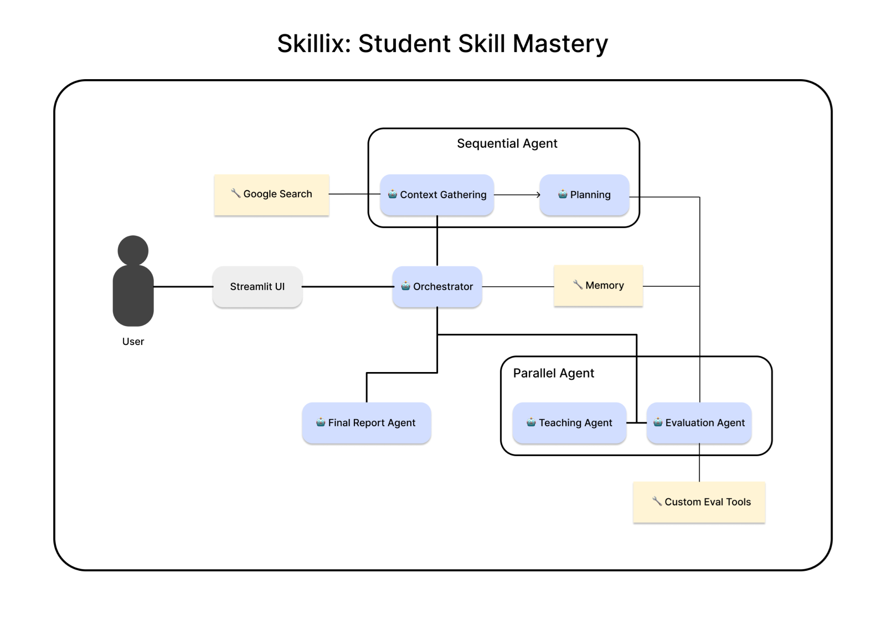

# skillix-ai-agent
Skillix is a multi-agent educational system built using Google’s Agent Development Kit (ADK) in Python. It is submitted to the **Agents for Good** track because it directly tackles a major problem in education: the lack of truly personalized, scalable, one-on-one tutoring for every student, especially for self-learners.

The system consists of five specialized agents coordinated by a central orchestrator, long-term memory (Memory Bank), and session state management. It turns a static topic request into a fully adaptive learning experience that adjusts in real-time to the student’s knowledge level, preferred learning style, and performance.

### Problem Statement
Traditional online education (videos, articles, MOOCs) is largely one-size-fits-all and passive. Students often:
- Receive content that is too easy or too hard
- Get spoon-fed answers instead of being guided to think critically
- Lack immediate, nuanced feedback on their understanding
- Have no clear visibility into their own strengths, weaknesses, or optimal learning style
- Drop out because the experience feels impersonal and ineffective

High-quality human tutoring is proven to be the most effective learning intervention (Bloom’s 2-sigma problem), but it is expensive and doesn’t scale. Skillix brings the benefits of an expert human tutor—personalization, Socratic questioning, real-time evaluation, and reflective insights to anyone who are curious to learn.

### Solution Statement
Skillix uses a multi-agent architecture where each agent has a clearly defined role, allowing the system to handle the end-to-end complexity of personalized education:

1. **Orchestrator Agent** – Acts as the “tutor session manager” that gathers initial user preferences and coordinates the entire workflow dynamically.
2. **Context Gathering Agent** – Searches the web, curates high-quality resources, and builds a rich knowledge base stored in long-term memory.
3. **Planning Agent** – Designs a personalized syllabus/roadmap based on the gathered context, user’s current knowledge level, and preferred learning style (theory-first, application-first, or hybrid).
4. **Teaching Agent** – Runs the interactive session using Socratic questioning and active recall. It forces the student to think instead of passively receiving information. Uses long-term memory for context and session state to remember everything that happened in previous interactions.
5. **Evaluating Agent** – Scores every student response in real-time (depth of understanding, partial credit, misconceptions) and updates performance memory.
6. **Final Report Agent** – At the end of the topic (or on demand), generates a detailed report with progress, identified strengths/weaknesses, recommended next topics, and even the student’s inferred learning style.



Agents communicate sequentially and in parallels (e.g., Teaching → Evaluating → Teaching again with adjusted difficulty), demonstrating sequential agents, parallel agents, session & memory management, custom tools, and long-term memory.

### Key ADK concepts demonstrated

- Multi-agent system with sequential and parallel agents  
- Sub-agents and delegation  
- Tools (web search via custom Google Search tool, custom evaluation scorer, memory read/write tools)  
- Sessions & state management (InMemorySessionService)  
- Long-term memory (Memory Bank for topic resources and user performance history)  
- Context compaction (summarizing gathered resources before storing)  
- Observability (structured logging of every agent turn and score)

### Essential Tools Implemented
- Web research tool (using Google Search)  
- Memory read/write tools (short-term session + long-term Memory Bank)  
- Custom evaluation tool that returns a structured score (0–100) + explanation + misconception list  

### Value Statement
> Need to add the value based on the true values

If I had more time I would:
- Add voice interaction for presenting a topic or enhanced QA sessions 
- Deploy the entire system on Vertex AI Agent Engine 
- Integrate MCP servers for real-time collaborative learning between multiple students

The link for the capstone project writeup is [Skillix: Multi-agent AI for student skill mastery](https://www.kaggle.com/competitions/agents-intensive-capstone-project/writeups/new-writeup-1763366506849)

Skillix proves that multi-agent systems can deliver truly personalized education at scale, making world-class tutoring accessible to everyone.

## Project Installation
1. Clone this github repo
```bash
git clone https://github.com/JaiSuryaPrabu/skillix-ai-agent
```
2. Use `uv` to install the packages for virtual environment by `sync` command
```bash
uv sync 
```
3. Activate your virtual environment by
```bash
source venv/bin/activate # macOS/Linux
venv\Scripts\activate.bat # Command Prompt Windows
.\venv\Scripts\Activate.ps1 # PowerShell Windows
```
3. `run.py` is used to run the streamlit app and to run the app (not yet implemented)
```bash
streamlit run run.py
```